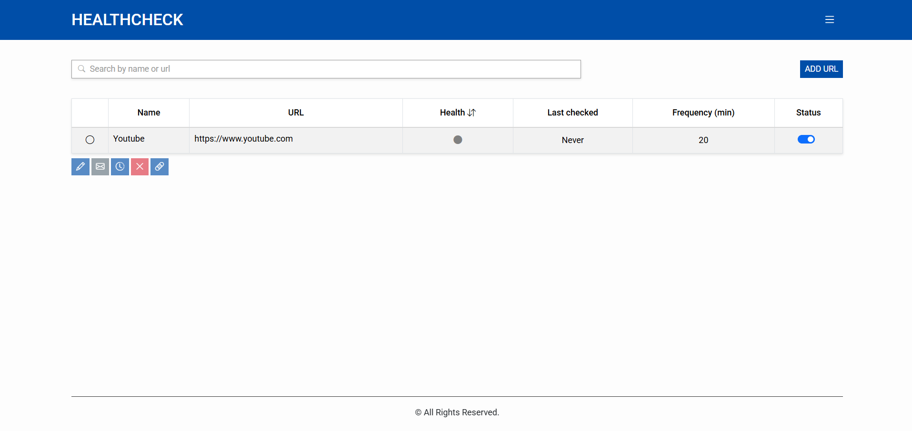
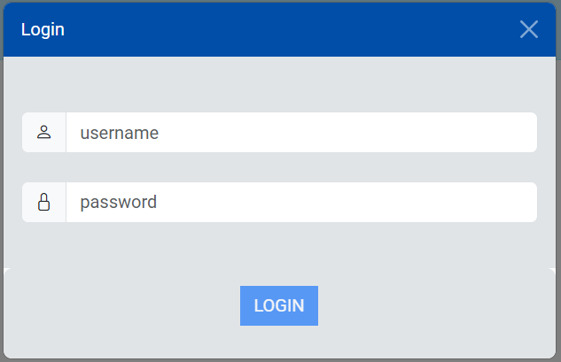
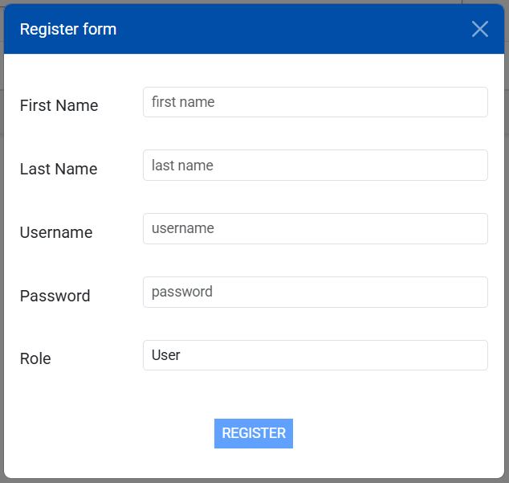
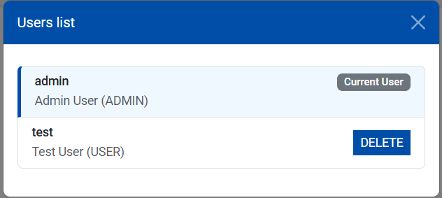
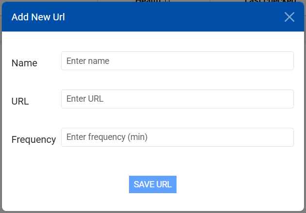
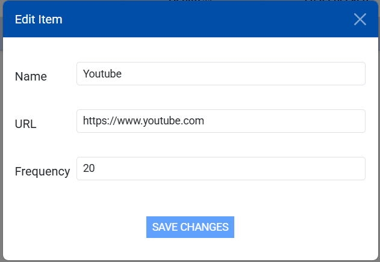
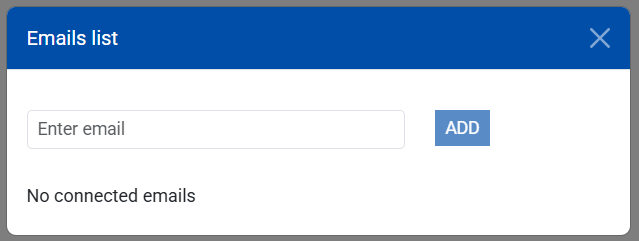
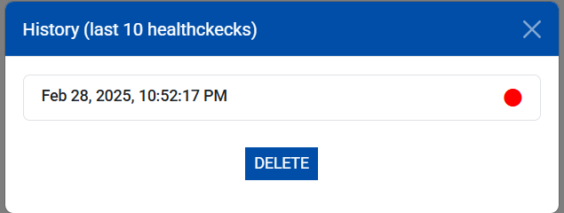

# HealthcheckApp

The **Healthcheck Monitoring App (Frontend)** is the web-based interface for monitoring the health status of various services. Built with **Angular**, this application provides an intuitive dashboard for users to track service statuses, manage monitored services, and perform different actions on a specific service.

## Features

- **Dashboard Overview**: Displays the status of all monitored services.
- **Service Management**: Allows authenticated users to add, edit, or remove monitored services.
- **Healthcheck Analysis**: Dispalys history of past health check results.
- **Authentication & Authorization**: Secure login system for managing services.
- **Responsive Design**: Optimized for both desktop and mobile devices.

## Main Page

The main dashboard provides a summary of all services being monitored, showing their health status in a table format. Selecting a service reveals additional actions at the bottom of the page, such as viewing logs, editing details, or removing the service.

### Screenshot

## User Management

The application features a secure authentication system. Only admin users can register new users, ensuring controlled access to the platform.

- **Login Page**: Users can log in securely.
- **Register Page**: Admins can create new user accounts.

### Screenshots

## Service Management

Users can add new services or edit existing ones.

### Screenshots

## Alert Email & History

- **Alert Email Modal**: Users can edit the list of email recipients for service alerts.
- **History Modal**: Displays past health check results.

### Screenshots

